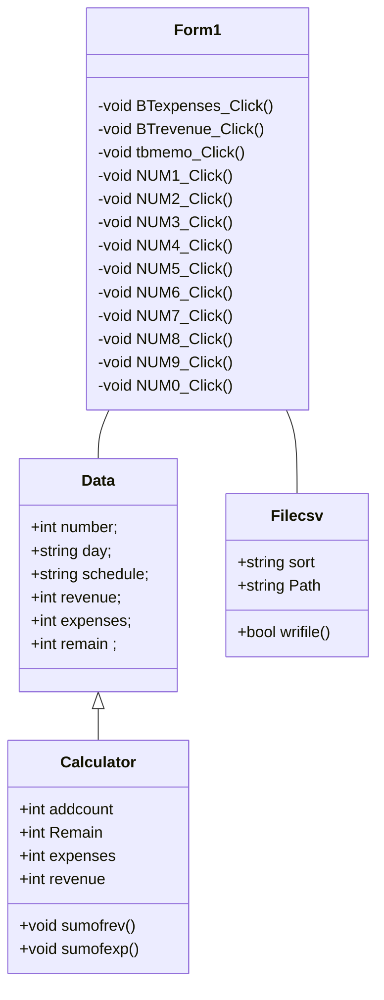

### ความเป็นมา
#### -ความเป็นมาของโปรแกรมรายรับรายจ่ายที่ได้ทำขึ้นมาจากอยากให้มีระเบียบวินัยในการใช้เงิน มีการวางแผนกาารใช้เงินและจะได้รู้ว่าในแต่ละวันมีการใช้จ่ายเงินกับอะไรบ้าง

### วัตถุประสงค์
#### -จุดประสงค์เพื่อบักทึกรายรับรายจ่ายเงินในแต่ละวันและสามารถดูย้อนหลังได้

### ชื่อของผู้พัฒนาโปรแกรม
#### นางสาวปานวาด คารินทา

